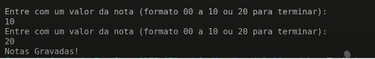
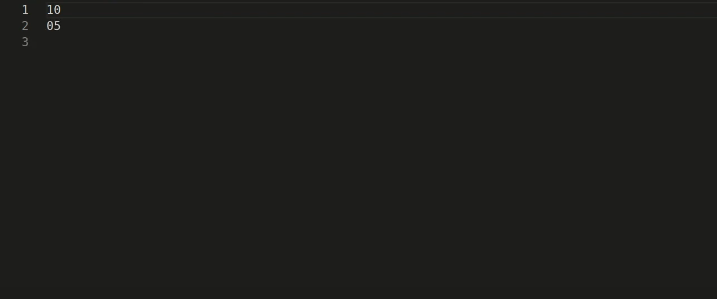

# GRAVADOR DE NOTAS
👨‍🏫PROJETO CRIADO PARA O CURSO DE ASSEMBLY.

 <br>
 <br>

## DESCRIÇÃO:
Este programa em `Assembly x86_64` solicita ao usuário a entrada de valores de notas, de 00 a 10, e grava essas notas em um arquivo. O programa continua a solicitar e gravar notas até que o usuário insira o valor "20", momento em que o programa finaliza a operação de gravação e exibe uma mensagem de confirmação antes de terminar.

## FUNCIONALIDADES:
1. **Abertura de Arquivo:** O programa abre um arquivo chamado "Nota" com permissões de criação, escrita e anexo.
2. **Solicitação de Entrada:** O programa solicita repetidamente ao usuário que insira uma nota, exibindo uma mensagem adequada para instruir o usuário.
3. **Gravação no Arquivo:** As notas inseridas são gravadas no arquivo.
4. **Verificação de Encerramento:** Se o usuário inserir "20", o programa para de solicitar notas, fecha o arquivo e exibe uma mensagem de confirmação.
5. **Encerramento do Programa:** Após exibir a mensagem de confirmação, o programa termina sua execução.

## COMO USAR?
1. **Compilação e Execução:** Compile o código em um ambiente compatível com `x86_64 Assembly`. Você pode usar o NASM (Netwide Assembler) para compilar e o LD (GNU Linker) para ligar o código.
    ```sh
    nasm -f elf64 -o main.o main.asm
    ld -o main main.o
    ./main
    ```
2. **Interação com o Usuário:** 
    - Ao executar o programa, uma mensagem será exibida solicitando que você insira uma nota no formato de 00 a 10.
    - Digite a nota desejada e pressione Enter.
    - As notas serão gravadas no arquivo "Nota".
    - Para terminar a entrada de notas, digite "20" e pressione Enter.
3. **Mensagens:**
    - "Entre com um valor da nota (formato 00 a 10 ou 20 para terminar):" – Instrução para o usuário inserir uma nota.
    - "Notas Gravadas!" – Confirmação exibida após cada nota ser gravada no arquivo.
    - Após inserir "20", o programa exibirá novamente "Notas Gravadas!" e então encerrará a execução.

## CREDITOS:
- [PROJETO CRIADO PARA O CURSO DE ASSEMBLY](https://github.com/VILHALVA/CURSO-DE-ASSEMBLY)
- [PROJETO FEITO PELO VILHALVA](https://github.com/VILHALVA)


